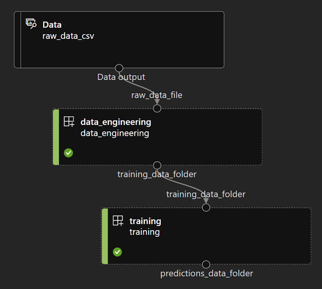
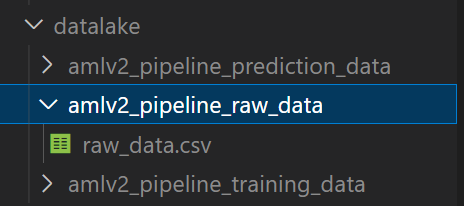

# azureml-v2-pipeline

## project description

This is an Azure ML CLIv2 template project demonstrating a very simple pipeline with inputs/outputs connected to a datalake.

We here have a simple pipeline with 2 steps:
- data-engineering, grabs data from a raw_data.csv file (this needs to be setup in your Azure ML environment, in a storage account container (recommending DataLake Gen2)), and defined as a datastore in AML (datastore named 'workspaceblobstore' here in this example, which is created by default in your AML workspace)
- training: sources data from the output of the data-engineering step, would in real life train a model, then perform predictions, and save these predictions to an output folder in the datalake



See:
```
outputs:
      predictions_data_folder:
        type: uri_folder
        mode: rw_mount
        path: azureml://datastores/workspaceblobstore/paths/datalake/aml_v2_pj_prediction_data
```

## how to run/develop the python code locally

Execute this from the root of the repo. This assumes you have the following 'local datalake' structure in the root of the repo (your local area with data sources snapshots, etc.):



Drop your training data into amlv2_pipeline_raw_data as 'raw_data.csv' (or any other name but update the following commands accordingly).

### Data Engineering:
Setup your local environment:
```
conda env create -f data-engineering/data-engineering-conda.yml
conda activate amlv2-p-data-engineering
```
Develop your code as needed, and run it locally using this command:
```
python data-engineering/data-engineering.py --raw_data_file datalake/amlv2_pipeline_raw_data/raw_data.csv --training_data_folder datalake/amlv2_pipeline_training_data
```

### Training:
Same comments as above, setup your training environment like this:
```
conda env create -f training/training-conda.yml
conda activate amlv2-p-training
```
Develop your code and test its execution as needed locally:
```
python training/training.py --training_data_folder datalake/amlv2_pipeline_training_data --predictions_data_folder datalake/amlv2_pipeline_prediction_data
```


## how to create and run the pipeline

Once you've developed and tested your code locally, you can easily package it to run in Azure at scale and for MLOps CI/CD purposes using the Azure CLI v2. Without any code change, you'll be able to run the exact same python code and link its sources/destinations to an actual Azure datalake via a pipeline yaml descriptor.

[Install the Azure CLI + the Azure CLI 'ml' extension](https://docs.microsoft.com/en-us/azure/machine-learning/how-to-configure-cli?tabs=public), then run the following to create the steps runtime environment (repeat this any time you need to modify the 'conda' files in each step folder to support code changes):

```
az ml environment create -f ./data-engineering/data-engineering-environment.yml
az ml environment create -f ./training/training-environment.yml
```
To trigger a pipeline creation/run, run the following (note the flag to turn on the parallel job private preview feature if it isn't in public preview when you run this):

```
az ml job create -f pipeline.yml --web
```
The --web parameter will let you jump directly into the AML Studio to monitor the pipeline execution.